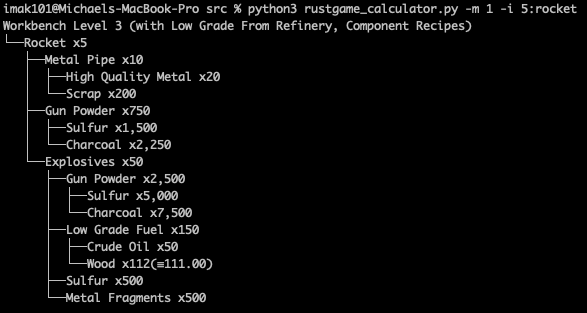
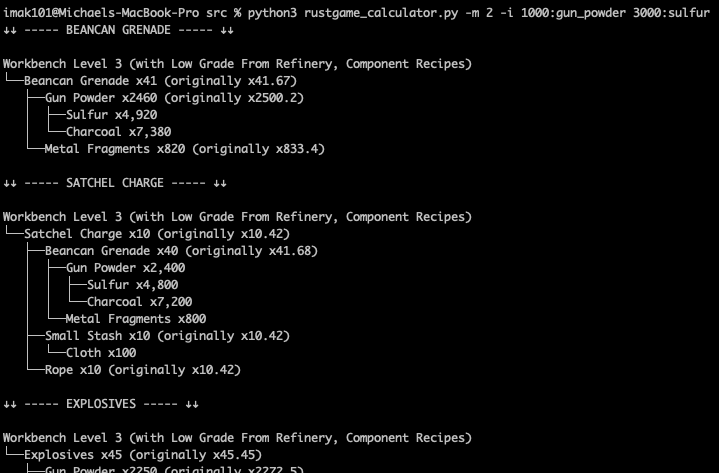

# rustgame_calculator
rustgame_calculator is a simple command-line application that can, at this time, calculate ingredient amounts required to craft X amount of items for the video game Rust. Another method that is available with the application calculates what all can be crafted with the provided input. At this time, the application outputs the result in the form of a tree with the base item as the root node.





# Usage
1. Clone this repository.
```
git clone https://github.com/imak101/rustgame_calculator.git
```
2. Enter the source directory.
```
cd src
```
3. Run the application with python3. Use -h to see options.
```
python3 rustgame_calculator.py -h
```

# Todo
- Add a GUI
- Add options menu
- Add more recipes
- Add crafting time estimation
- Add raid calculator
